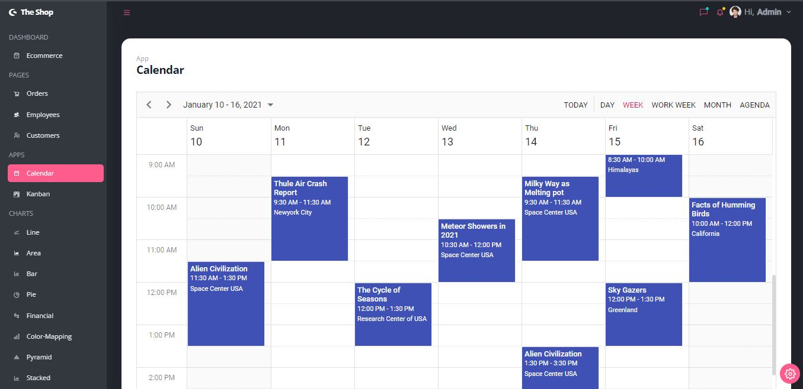
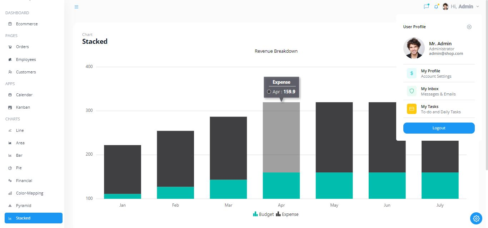
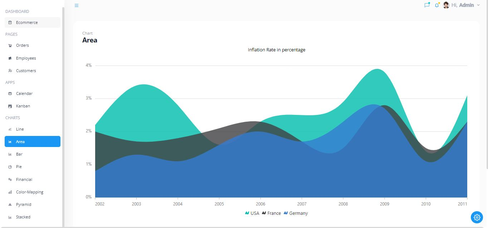

# Admin Dashboard Web App

An Admin Dashboard WebApp built with CRUD functionalities using React.

### [Web App Demo here!](https://react-admin-dashboard-crud.vercel.app/ecommerce)

## How to install app

### `npm install`

#### I recommend running the command 

`npm install --legacy-peer-deps`  

but the above should suffice

## How to run app

### `npm start`

(Runs on port 3000 by default)

